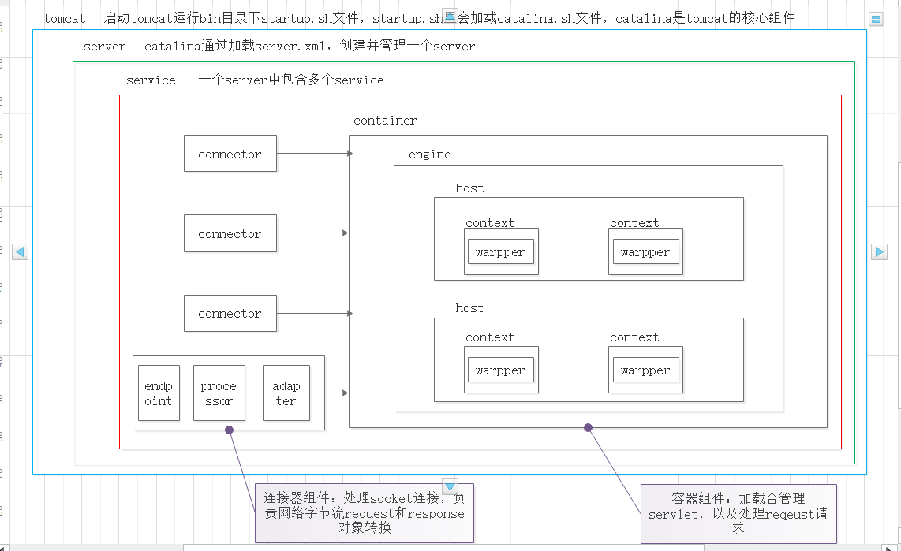

**重要：作业一读取项目磁盘统一路径：**

**appBase="/Users/webapps"**

**并且提交自己的webapps以及访问路径**

作业⼀（编程题）：
 开发Minicat V4.0，在已有Minicat基础上进⼀步扩展，模拟出webapps部署效果 磁盘上放置⼀个webapps⽬录，webapps中可以有多个项⽬，⽐如demo1,demo2,demo3... 具体的项⽬⽐如demo1中有serlvet（也即为：servlet是属于具体某⼀个项⽬的servlet），这样的话在 Minicat初始化配置加载，以及根据请求url查找对应serlvet时都需要进⼀步处理、

**将两个项目放到D盘根目录下**
**访问地址如下**
http://localhost:8080/demo1/ki
http://localhost:8080/demo2/ki

作业⼆（简答题）： 请详细描述Tomcat体系结构（图⽂并茂）

Tomcat服务器的启动是基于一个server.xml文件的，Tomcat启动的时候首先会启动一个Server，Server里面就会启动Service，Service里面就会启动多个"Connector(连接器)"，每一个连接器都在等待客户机的连接。

当有用户使用浏览器去访问服务器上面的web资源时，首先是连接到Connector(连接器)，连接器中的Endpoint(通信端点)接收Socket请求，调用Processor处理，Processor解析处理socket，封装Request，再调用CoyoteAdapter进行路径映射，并将Request对象转换为ServletRequest对象，

继续将用户的请求交给一个Engine(引擎)去处理，Engine(引擎)接收到请求后就会解析用户想要访问的Host，然后将请求交给相应的Host，Host收到请求后就会解析出用户想要访问这个Host下面的哪一个Web应用,一个web应用对应一个Context。

**作业具体要求参考以下链接文档：**https://gitee.com/lagouedu/test/raw/master/%E7%AC%AC%E4%BA%8C%E9%98%B6%E6%AE%B5/tomcat%E4%BD%9C%E4%B8%9A%E9%A2%98/Tomcat%E4%BD%9C%E4%B8%9A%E5%A4%A7%E9%A2%98.zip
